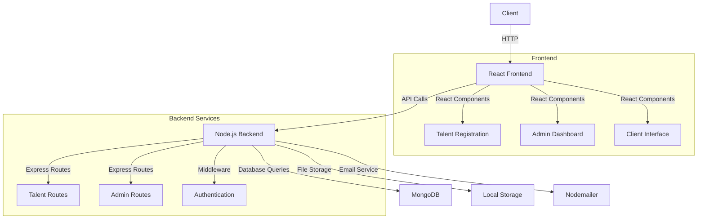

# 🎯 Talent Platform - JPD Hub Hackathon 2025

<div align="center">
  
  
  [](https://jpdhub.com)
  [](https://advitiya.iitrpr.ac.in)
  []()
  []()
</div>


## 🏆 Hackathon Submission

#### This project was developed for the JPD Hub x Advitiya Hackathon 2025, IIT Ropar.

**Third Place Winner** 🥉 at JPDxAdvitiya Hackathon 2025


## 💡 Problem Statement

<div style="display: flex; align-items: center; gap: 20px;">
  <div>

#### JPD Hub needs a Talent Module that connects talented individuals with clients while maintaining admin control. The platform should:

- Enable talent registration and profile management
- Provide client access to talent pool
- Include admin controls for profile verification
- Facilitate hiring process management
  </div>
  
  
</div>


## 💡 Our Solution
### Our solution is a comprehensive talent management platform that streamlines the process of connecting talented individuals with potential clients, while ensuring quality through admin verification.

<div align="center">
  
</div>

### Key Features Implemented
1. **Talent Registration & Admin Approval** ✅
   - Secure registration form with validation
   - Profile photo upload with preview
   - Admin review system
   - Email/WhatsApp notifications

2. **Talent Profile Display** ✅
   - Clean, responsive UI
   - Advanced search and filters
   - Skill-based categorization

3. **Client Interaction** ✅
   - Seamless browsing experience
   - Secure hire request system
   - Real-time notifications

4. **Admin Dashboard** ✅
   - Profile verification system
   - Request management
   - Analytics and reporting

5. **Modern UI/UX Design** ✅ **(Recently Enhanced)**
   - Premium landing page with gradient backgrounds and animations
   - Interactive admin dashboard with real-time search and filtering
   - Modern component system with consistent styling
   - Mobile-responsive design across all devices
   - Smooth transitions and hover effects
   - Professional color scheme and typography

## 🎨 Recent UI Improvements

<div align="center">
  
  <p><em>Enhanced Admin Dashboard with modern stats cards, search functionality, and responsive design</em></p>
</div>

### ✨ What's New:
- **🚀 Landing Page**: Complete redesign with hero section, testimonials, and interactive elements
- **📊 Admin Dashboard**: Modern stats cards, advanced filtering, and improved profile management
- **🎯 Interactive Components**: Hover animations, smooth transitions, and micro-interactions
- **📱 Mobile First**: Responsive design optimized for all screen sizes
- **🎨 Design System**: Consistent colors, typography, and spacing throughout

### 🛠️ Technical Enhancements:
- Custom CSS animations and transitions
- Gradient backgrounds and modern shadows
- Improved accessibility with proper focus states
- Performance-optimized components
- TypeScript interfaces for better development experience

<!-- ## 🖥️ Demo & Screenshots

<div align="center">
  
  
</div> -->

<!-- ### 🔗 Live Demo
- [Frontend Application](https://your-demo-link.com)
- [Admin Dashboard](https://your-admin-demo.com)
- [Demo Video](https://youtube.com/your-demo-video) -->

## 📊 Architecture

#### The Talent Platform uses a simple three-tier architecture with React frontend, Node.js backend, and MongoDB database.



<br>

## 📝 UI Wireframes (Rough Layout)

<details>
  <summary>Click to expand!</summary>

> **Note**: These are ASCII art representations of our planned UI layout, not the final design. They serve as a basic visualization of component structure and user flow.

### 🏠 Home Page Layout

```bash
+-------------Home Page / Landing-----------------+
|                                                |
|     🎯 Connect with Top Tech Talent            |
|     Find the perfect talent for your project   |
|                                                |
|     [Browse Talents]  [Register as Talent]     |
|                                                |
|  +----------------Features------------------+  |
|  |                                          |  |
|  |  🔍 Easy Search    🔒 Verified Profiles |  |
|  |  📝 Quick Apply    ⭐ Top Talent        |  |
|  |                                          |  |
|  +-----------------------------------------+   |
+------------------------------------------------+

```

### 📋 Registration Form Layout

```bash
+------------------------------------------+
|           Talent Platform                 |
|  [Logo]     Browse  Register   Admin     |
+------------------------------------------+

+------------------Registration Form----------------+
|                                                  |
|                 [Photo Upload]                   |
|                     ⭕️                          |
|                                                  |
|  Full Name: +-------------------------+          |
|             |                         |          |
|             +-------------------------+          |
|                                                  |
|  Email:    +-------------------------+          |
|             |                         |          |
|             +-------------------------+          |
|                                                  |
|  Skills:    +-------------+ [Add Skill]         |
|             |             |                      |
|             +-------------+                      |
|                                                  |
|  [JavaScript] [React] [Node.js] [MongoDB]       |
|     (clickable tags with 'x' to remove)         |
|                                                  |
|  Bio:       +-------------------------+          |
|             |                         |          |
|             |                         |          |
|             +-------------------------+          |
|                                                  |
|          [    Submit Registration    ]           |
|                                                  |
+--------------------------------------------------+
```

### 🔍 Talent Directory Layout

```bash
+-------------------Talent Directory----------------+
|  Search: +----------------+ [Search]             |
|                                                  |
|  +----------------+ +------------------+         |
|  | Talent Card 1  | | Talent Card 2    |         |
|  | [Photo]        | | [Photo]          |         |
|  | Name           | | Name             |         |
|  | Skills         | | Skills           |         |
|  | Bio            | | Bio              |         |
|  +----------------+ +------------------+         |
|                                                  |
|  +----------------+ +------------------+         |
|  | Talent Card 3  | | Talent Card 4    |         |
|  | [Photo]        | | [Photo]          |         |
|  | Name           | | Name             |         |
|  | Skills         | | Skills           |         |
|  | Bio            | | Bio              |         |
|  +----------------+ +------------------+         |
+--------------------------------------------------+
```

### 👤 Profile Page Layout

```bash
+--------------Talent Profile Page----------------+
|                                                |
|    [Profile Photo]     Status: ✅ Verified     |
|    John Doe                                    |
|    Full-Stack Developer                        |
|                                                |
|    Skills:                                     |
|    [React] [Node.js] [MongoDB] [TypeScript]    |
|                                                |
|    About Me:                                   |
|    +--------------------------------------+    |
|    | Professional developer with 5 years...|   |
|    +--------------------------------------+    |
|                                                |
|    Projects:                                   |
|    - E-commerce Platform                       |
|    - Social Media App                          |
|                                                |
|    [Contact] [Download CV] [Hire Me]           |
+------------------------------------------------+

```


### 📊 Admin Dashboard Layout

```bash
+-------------------Admin Dashboard----------------+
|                                                  |
|  Pending Approvals (3)                          |
|  +----------------------------------------+     |
|  | [Photo] Name: John Doe                 |     |
|  | Skills: React, Node.js                 |     |
|  | [Approve] [Reject]                     |     |
|  +----------------------------------------+     |
|                                                 |
|  +----------------------------------------+     |
|  | [Photo] Name: Jane Smith               |     |
|  | Skills: Python, AWS                    |     |
|  | [Approve] [Reject]                     |     |
|  +----------------------------------------+     |
+--------------------------------------------------+

```
```bash
+---------------Search Results--------------------+
|  Filters:                                      |
|  Skills: [×React] [×Node.js]                   |
|  Experience: [0-2] [2-5] [5+] years            |
|  Location: [Remote] [On-site]                  |
|                                                |
|  Found 15 matches                              |
|  +----------------+ +------------------+       |
|  | [Photo]        | | [Photo]          |       |
|  | Sarah Chen     | | Mike Johnson     |       |
|  | React Expert   | | Full-Stack Dev   |       |
|  | ⭐⭐⭐⭐⭐    | | ⭐⭐⭐⭐        |       | 
|  +----------------+ +------------------+       |
+------------------------------------------------+
```

```bash
+--------------Admin Analytics--------------------+
|                                                |
|  📊 Dashboard Overview                         |
|  +-------------------+ +-------------------+   |
|  | New Registrations | | Pending Approvals |   |
|  |        24         | |         7         |   |
|  +-------------------+ +-------------------+   |
|                                                |
|  🔍 Recent Activity                            |
|  | Time     | Action    | User              |  |
|  | 10:45 AM | Approved  | John Doe          |  |
|  | 10:30 AM | Rejected  | Invalid Profile   |  |
|  | 10:15 AM | New Reg.  | Sarah Chen        |  |
|                                                |
|  📈 Weekly Stats                               |
|  +--------------------------------------+      |
|  |    ▁▃▅▇█▇▅  Registrations           |       |
|  |    ▂▄▆▇▆▄▂  Approvals              |        |
|  +--------------------------------------+      |
+------------------------------------------------+

```

```bash
+-------------Notification Panel------------------+
|  🔔 Notifications                              |
|                                                |
|  [Today]                                       |
|  • Profile approved by admin                   |
|  • New message from client                     |
|                                                |
|  [Yesterday]                                   |
|  • Profile view by Company XYZ                 |
|  • Skills endorsed by peer                     |
|                                                |
|  [Settings ⚙️]                                 |
|  □ Email notifications                         |
|  □ Push notifications                          |
+------------------------------------------------+

```

```bash
+-------------Message Center---------------------+
|  📨 Messages                                  |
|  +------------------------------------------+ |
|  | Search messages...        [Filter ▼]     | |
|  +------------------------------------------+ |
|                                               |
|  [Active Chats]                               |
|  +------------------------------------------+ |
|  | 🟢 Tech Corp                             | |
|  | Latest: When can you start...            | |
|  +------------------------------------------+ |
|  | 🔴 StartUp Inc                           | |
|  | Latest: Thanks for your time...          | |
|  +------------------------------------------+ |
+----------------------------------------------+

```
</details>

> These wireframes demonstrate the basic structure and component relationships in our application. The actual implementation uses modern UI components with Tailwind CSS styling.


### 🔄 Component Relationships
- Home Page → Registration/Directory
- Directory → Individual Profiles
- Admin Dashboard → Profile Management
- Profile → Messaging System

<br>
<hr>

## 🛠️ Technology Stack

<div class="tech-grid" style="display: flex; gap: 20px;">
  
  
  
  
  
</div>

<br>

- **Frontend**: React.js with TypeScript
- **Backend**: Node.js
- **Database**: MongoDB
- **File Storage**: AWS S3
- **Notifications**: Twilio WhatsApp API
- **Styling**: Tailwind CSS + Custom CSS Animations
- **Icons**: React Icons
- **UI Components**: Custom Component System
- **Animations**: CSS Transitions & Transforms
- **Design**: Modern Gradient Themes & Glass Morphism

## 🚦 Getting Started

### Prerequisites
- Node.js (v18 or higher) 
- npm (v9 or higher)
- MongoDB (v6 or higher)
- MongoDB Compass (for database management)
- Git vcs

### Quick Start with Docker (Recommended)

1. **Clone the repository:**
   ```bash
   git clone https://github.com/Rudra00codes/Talent-Module.git
   cd Talent-Module/talent-platform
   ```

2. **Start the entire application:**
   ```bash
   docker-compose up --build
   ```

   This will start:
   - MongoDB on port 27017
   - Backend API on port 8080  
   - Frontend on port 3000

3. **Access the application:**
   - Frontend: http://localhost:3000
   - Backend API: http://localhost:8080
   - API Documentation: See API.md

### Manual Setup (Development)

#### Backend Setup
```bash
cd talent-platform/backend

# Install dependencies
npm install

# Copy environment file and configure
cp .env.example .env
# Edit .env with your MongoDB URI and other settings

# Start development server
npm run dev
```

#### Frontend Setup  
```bash
cd talent-platform/talent-platform-frontend

# Install dependencies
npm install

# Copy environment file and configure
cp .env.example .env
# Edit .env with your API URL

# Start development server  
npm run dev
```

### Production Deployment

See [DEPLOYMENT.md](DEPLOYMENT.md) for comprehensive production deployment instructions including:
- Docker-based deployment
- SSL/HTTPS setup
- Environment configuration
- Database setup and security
- Monitoring and maintenance

## 🔧 Recent Improvements & Fixes

### ✅ What Was Fixed
- **Backend Architecture**: Complete restructure with proper TypeScript implementation
- **Database Integration**: Proper MongoDB connection with Mongoose ODM
- **API Services**: RESTful API with comprehensive error handling
- **Authentication**: JWT-based authentication system with role-based access
- **File Upload**: Multer integration for profile photo uploads  
- **Email Notifications**: SMTP integration for admin and talent notifications
- **Error Handling**: Comprehensive error middleware and validation
- **Security**: Input validation, CORS configuration, and security headers
- **Dependencies**: All missing packages installed and security vulnerabilities fixed
- **Build System**: Both frontend and backend now build successfully
- **Type Safety**: Complete TypeScript implementation with proper types
- **API Documentation**: Comprehensive API documentation with examples
- **Deployment**: Docker configurations and production-ready setup

### 🔧 Technical Stack
- **Frontend**: React 18 + TypeScript + Vite + Tailwind CSS
- **Backend**: Node.js + Express + TypeScript + MongoDB
- **Authentication**: JWT tokens with bcryptjs
- **File Upload**: Multer with local storage
- **Email**: Nodemailer with SMTP support
- **Deployment**: Docker + Docker Compose + Nginx

   
### Running the Project

<details>
  <summary>Expand to View</summary>

1. **Start MongoDB:**
   - Ensure MongoDB service is running
   - Keep MongoDB Compass open for database monitoring

2. **Start Backend Server:**
   ```bash
   cd backend
   npm run dev
   ```

3. **Start Frontend Development Server:**
   ```bash
   cd talent-platform-frontend
   npm run dev
   ```

4. **Access the Application:**
   - Frontend: `http://localhost:5173`
   - Backend API: `http://localhost:8080`
   - Admin Dashboard: `http://localhost:5173/admin`

### Troubleshooting
- If MongoDB fails to connect, ensure the MongoDB service is running
- If ports are occupied, update PORT in backend `.env`
- For frontend build issues, try clearing npm cache:
  ```bash
  npm cache clean --force

</details>

## 📱 Features & Screenshots

<div align="center">
  
  
</div>

### Feature Highlights
- **Smart Form Validation**: Real-time validation with helpful error messages
- **Responsive Design**: Works seamlessly on all devices
- **Secure File Upload**: Support for profile photo upload with preview
- **Admin Controls**: Comprehensive dashboard for profile management

## 🔒 Security Features
- Input validation and sanitization
- Secure file upload handling
- Protected admin routes
- Rate limiting for API endpoints

## 🎯 Future Scope
- [ ] AI-powered talent matching
- [ ] Video interview integration
- [ ] Blockchain-based skill verification
- [ ] Mobile application
- [ ] Advanced analytics dashboard

<hr>

## Team Details
| Name | Role | GitHub |
|------|------|--------|
| Yugandhar Bhardwaj | Project Lead | [@github](https://github.com) |
| Rudra Pratap Singh | Frontend-Backend Integrator | [@Rudra00codes](https://github.com/Rudra00codes) |
| Anant Srivastava | Backend and Feature Developer | [@RoboShep](https://github.com)
| Prince Sharma |  Researcher  | [@github](https://github.com) |
| Aditya Punj | UI/UX Designer | [@github](https://github.com) |

<br>

# Create a zip file

```bash
zip -r talent-platform.zip talent-platform/ \
   -x "talent-platform/node_modules/*" \
   -x "talent-platform/*/node_modules/*" \
   -x "talent-platform/.git/*" \
   -x "talent-platform/*/.env"
```
## 🙏 Acknowledgments
- JPD Hub for the opportunity
- Advitiya IIT Ropar for hosting
- All open-source libraries used in this project

## 📄 License

This project is licensed under the MIT License - see the LICENSE.md file for details.

