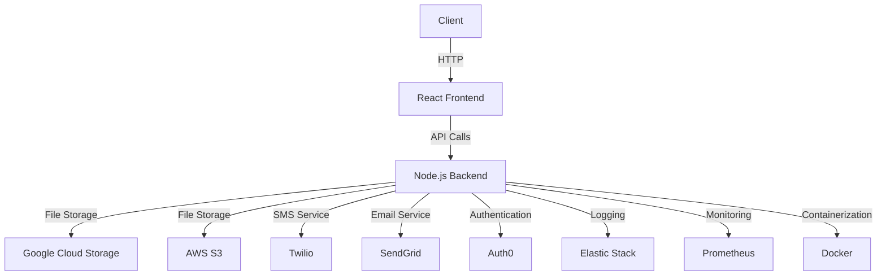

# 🎯 Talent Platform - JPD Hub Hackathon 2025

<div align="center">
  
  
  [](https://jpdhub.com)
  [](https://advitiya.iitrpr.ac.in)
  []()
  []()
</div>


## 🏆 Hackathon Submission

<div style="display: flex; align-items: center; gap: 20px;">
  <div>
    This project was developed for the JPD Hub x Advitiya Hackathon 2025, IIT Ropar.
  </div>
  
</div>


## 💡 Problem Statement
JPD Hub needs a Talent Module that connects talented individuals with clients while maintaining admin control. The platform should:
- Enable talent registration and profile management
- Provide client access to talent pool
- Include admin controls for profile verification
- Facilitate hiring process management


## 💡 Our Solution
### Our solution is a comprehensive talent management platform that streamlines the process of connecting talented individuals with potential clients, while ensuring quality through admin verification.

<div align="center">
  
</div>

### Key Features Implemented
1. **Talent Registration & Admin Approval** ✅
   - Secure registration form with validation
   - Profile photo upload with preview
   - Admin review system
   - Email/WhatsApp notifications

2. **Talent Profile Display** ✅
   - Clean, responsive UI
   - Advanced search and filters
   - Skill-based categorization

3. **Client Interaction** ✅
   - Seamless browsing experience
   - Secure hire request system
   - Real-time notifications

4. **Admin Dashboard** ✅
   - Profile verification system
   - Request management
   - Analytics and reporting

## 🖥️ Demo & Screenshots

<div align="center">
  
  
</div>

### 🔗 Live Demo
- [Frontend Application](https://your-demo-link.com)
- [Admin Dashboard](https://your-admin-demo.com)
- [Demo Video](https://youtube.com/your-demo-video)

## 📊 Architecture

#### The architecture of the Talent Platform consists of a React frontend that communicates with a Node.js backend.

#### The backend handles various services such as CRUD operations, file storage, SMS and email services, authentication, logging, monitoring, and containerization. Below is a visual representation of the architecture:



## 🛠️ Technology Stack

<div class="tech-grid" style="display: flex; gap: 20px;">
  
  
  
  
  
</div>

<br>

- **Frontend**: React.js with TypeScript
- **Backend**: Node.js
- **Database**: MongoDB
- **File Storage**: AWS S3
- **Notifications**: Twilio WhatsApp API
- **Styling**: Tailwind CSS

## 📂 Project Structure

<details>
  <summary>Click to expand!</summary>

```bash
talent-platform/
├── backend/
│   ├── config/
│   │   ├── database.js
│   │   └── whatsapp.js
│   ├── controllers/
│   │   ├── adminController.js
│   │   ├── clientController.js
│   │   └── talentController.js
│   ├── middleware/
│   │   ├── adminAuth.js
│   │   └── auth.js
│   ├── models/
│   │   ├── Client.js (deleted)
│   │   ├── Client.ts
│   │   ├── HireRequest.js
│   │   ├── Talent.js
│   │   ├── Talent.ts
│   │   └── User.js
│   ├── routes/
│   │   ├── adminRoutes.js
│   │   ├── clientRoutes.js
│   │   └── talentRoutes.js
│   ├── services/
│   │   ├── emailService.js
│   │   ├── fileUploadService.js
│   │   └── notificationService.ts
│   └── .env
├── talent-platform-frontend/
│   ├── public/
│   │   ├── banner.png
│   │   ├── index.html (deleted)
│   │   ├── manifest.json
│   │   ├── robots.txt
│   │   └── screenshots/
│   │       ├── dashboard.png
│   │       └── profile.png
│   ├── src/
│   │   ├── components/
│   │   │   ├── Navbar.tsx
│   │   │   ├── ProtectedRoute.tsx
│   │   │   ├── talent/
│   │   │   │   ├── TalentCard.tsx
│   │   │   │   ├── TalentList.tsx
│   │   │   │   └── TalentSearch.tsx
│   │   ├── pages/
│   │   │   ├── admin/
│   │   │   │   ├── Dashboard.tsx
│   │   │   │   ├── TalentApproval.js
│   │   │   ├── client/
│   │   │   │   ├── Dashboard.tsx
│   │   │   │   ├── Registration.tsx
│   │   │   ├── talent/
│   │   │   │   ├── Directory.tsx
│   │   │   │   ├── Profile.tsx
│   │   │   │   └── Registration.tsx
│   │   ├── styles/
│   │   │   ├── AdminDashboard.css
│   │   │   ├── TalentRegistration.css
│   │   ├── App.css
│   │   ├── App.tsx
│   │   ├── index.css
│   │   ├── index.jsx
│   │   ├── main.jsx
│   │   ├── reportWebVitals.js
│   │   ├── setupTests.js
│   ├── .gitignore
│   ├── eslint.config.js
│   ├── package.json
│   ├── package-lock.json
│   ├── README.md
│   ├── tsconfig.app.json
│   ├── tsconfig.json
│   ├── tsconfig.node.json
│   └── vite.config.ts
└── README.md
```
</details>

## 🚦 Getting Started

### Prerequisites

- Node.js (v14 or higher)
- npm (v6 or higher)

## 🚀 Installation & Setup

1. Clone the repository:
   ```bash
   git clone https://github.com/yourusername/talent-platform.git
   ```

2. Install dependencies:
   ```bash
   cd talent-platform
   npm install
   ```

3. Set up environment variables:
   ```bash
   cp .env.example .env
   # Update .env with your credentials
   ```

4. Start the development server:
   ```bash
   npm run dev
    ```
5. Open your browser and navigate to `http://localhost:3000` to view the application.


## 📱 Features & Screenshots

<div align="center">
  
  
</div>

### Feature Highlights
- **Smart Form Validation**: Real-time validation with helpful error messages
- **Responsive Design**: Works seamlessly on all devices
- **Secure File Upload**: Support for profile photo upload with preview
- **Admin Controls**: Comprehensive dashboard for profile management

## 🔒 Security Features
- Input validation and sanitization
- Secure file upload handling
- Protected admin routes
- Rate limiting for API endpoints

## 🎯 Future Scope
- [ ] AI-powered talent matching
- [ ] Video interview integration
- [ ] Blockchain-based skill verification
- [ ] Mobile application
- [ ] Advanced analytics dashboard

<hr>

## Team Details
| Name | Role | GitHub |
|------|------|--------|
| Yugandhar Bhardwaj | Project Lead | [@github](https://github.com) |
| Rudra Pratap Singh | Frontend-Backend Integrator | [@Rudra00codes](https://github.com/Rudra00codes) |
| Anant Srivastava | Backend and Feature Developer | [@RoboShep](https://github.com)
| Prince Sharma |  Researcher  | [@github](https://github.com) |
| Aditya Punj | UI/UX Designer | [@github](https://github.com) |


## 🙏 Acknowledgments
- JPD Hub for the opportunity
- Advitiya IIT Ropar for hosting
- All open-source libraries used in this project

## 📄 License

This project is licensed under the MIT License - see the LICENSE.md file for details.

