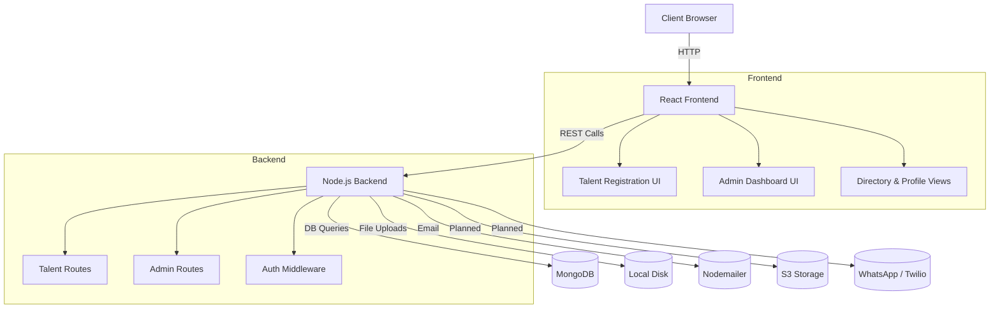

# 🎯 Talent Platform - JPD Hub Hackathon 2025

<div align="center">
   
  
   [](https://jpdhub.com)
   [](https://advitiya.iitrpr.ac.in)
   []()
   []()
</div>


## 🏆 Hackathon Submission

#### This project was developed for the JPD Hub x Advitiya Hackathon 2025, IIT Ropar.

**Third Place Winner** 🥉 at JPDxAdvitiya Hackathon 2025


## 💡 Problem Statement

JPD Hub needed a Talent Module that connects vetted talent with clients while preserving admin oversight for quality control and secure hiring.

Core needs:
- Talent registration & profile management
- Discoverable, filterable talent directory for clients
- Admin verification workflow
- Managed hire request / approval flow


## 💡 Solution Overview
The platform streamlines talent onboarding, verification, discovery, and client interaction through a unified React + Node.js stack with an admin approval layer.

### ✅ Implemented Core Features
- Talent registration with validation & profile photo upload
- Admin approval workflow (verify / manage submissions)
- Talent listing with responsive cards & basic filtering
- Secure API with structured error handling
- Email notifications (on registration / admin actions)
- Modern landing page (glass morphism navbar, premium sections, animations)
- TypeScript across frontend & backend for type safety

### 🚧 In Progress / Planned
- Advanced filtering (skills / experience / location)
- Hire request initiation & tracking UX
- WhatsApp / multi-channel notifications (Twilio – planned)
- File storage externalization (S3 – planned; currently local uploads)
- Real-time updates (WebSocket / SSE) for admin dashboard

<!-- ## 🖥️ Demo & Screenshots

<div align="center">
  
  
</div> -->

<!-- ### 🔗 Live Demo
- [Frontend Application](https://your-demo-link.com)
- [Admin Dashboard](https://your-admin-demo.com)
- [Demo Video](https://youtube.com/your-demo-video) -->

## 📊 Architecture

Three-tier architecture (React SPA / Express API / MongoDB) with modular services.



> Planned nodes (S3 Storage, WhatsApp / Twilio) are not yet implemented.

### 🔄 Component Relationships
- Home Page → Registration/Directory
- Directory → Individual Profiles
- Admin Dashboard → Profile Management
- Profile → Messaging System

<br>
<hr>

## 🛠️ Technology Stack

<div class="tech-grid" style="display: flex; gap: 20px;">
  
  
  
  
  
</div>

<br>

- **Frontend**: React.js with TypeScript
- **Backend**: Node.js
- **Database**: MongoDB
- **File Storage**: Local disk (S3 planned)
- **Notifications**: Email (WhatsApp/Twilio planned)
- **Styling**: Tailwind CSS + Custom CSS Animations
- **Icons**: React Icons
- **UI Components**: Custom Component System
- **Animations**: CSS Transitions & Transforms
- **Design**: Modern Gradient Themes & Glass Morphism

## 🚦 Getting Started

### Prerequisites
- Node.js (v18 or higher) 
- npm (v9 or higher)
- MongoDB (v6 or higher)
- MongoDB Compass (for database management)
- Git vcs

### Quick Start with Docker (Recommended)

1. **Clone the repository:**
   ```bash
   git clone https://github.com/Rudra00codes/Talent-Module.git
   cd Talent-Module/talent-platform
   ```

2. **Start the entire application:**
   ```bash
   docker-compose up --build
   ```

   This will start:
   - MongoDB on port 27017
   - Backend API on port 8080  
   - Frontend on port 3000

3. **Access the application:**
   - Frontend: http://localhost:3000
   - Backend API: http://localhost:8080
   - API Documentation: See API.md

### Manual Setup (Development)

#### Backend Setup
```bash
cd talent-platform/backend

# Install dependencies
npm install

# Copy environment file and configure
cp .env.example .env
# Edit .env with your MongoDB URI and other settings

# Start development server
npm run dev
```

#### Frontend Setup  
```bash
cd talent-platform/talent-platform-frontend

# Install dependencies
npm install

# Copy environment file and configure
cp .env.example .env
# Edit .env with your API URL

# Start development server  
npm run dev
```

### Production Deployment

See [DEPLOYMENT.md](DEPLOYMENT.md) for comprehensive production deployment instructions including:
- Docker-based deployment
- SSL/HTTPS setup
- Environment configuration
- Database setup and security
- Monitoring and maintenance

## 🔧 Implementation Notes
Key engineering work completed: type-safe Express API, modular routes, email notifications, multer-based uploads, adaptive glass UI, deployment-ready Docker setup, and global font + animation system.

   
### Quick Dev Run (Manual)
Backend: `cd talent-platform/backend && npm run dev`
Frontend: `cd talent-platform/talent-platform-frontend && npm run dev`
Frontend dev URL: http://localhost:5173  |  API: http://localhost:8080

Troubleshooting:
- Mongo not connecting → verify service / URI
- Port in use → adjust PORT / VITE_PORT env
- Stale types → delete `dist` then rebuild

## 📱 Features & Screenshots

<div align="center">
  
  
</div>

### Feature Highlights
- Form validation with feedback
- Responsive design system
- Secure profile photo upload
- Admin verification controls

## 🔒 Security & Hardening
- Input validation & sanitisation
- CORS configuration
- Security headers (helmet)
- Safe file upload handling (Multer + path constraints)
- (Planned) Rate limiting & audit logging

## 🎯 Roadmap
- [ ] Advanced directory filtering (skills / experience)
- [ ] Hire request lifecycle UI
- [ ] WhatsApp / multi-channel notifications
- [ ] S3 object storage integration
- [ ] AI-assisted talent recommendations
- [ ] Real-time dashboard updates
- [ ] Mobile app shell

<hr>

## 👥 Team
| Name | Role | GitHub |
|------|------|--------|
| Yugandhar Bhardwaj | Project Lead | — |
| Rudra Pratap Singh | Frontend & Integration | [@Rudra00codes](https://github.com/Rudra00codes) |
| Anant Srivastava | Backend Developer | [@RoboShep](https://github.com/RoboShep) |
| Prince Sharma | Research | — |
| Aditya Punj | UI/UX Designer | — |

<br>

---
## 🙏 Acknowledgments
- JPD Hub for the opportunity
- Advitiya IIT Ropar for hosting
- All open-source libraries used in this project

## 📄 License

This project is licensed under the MIT License - see the LICENSE.md file for details.

