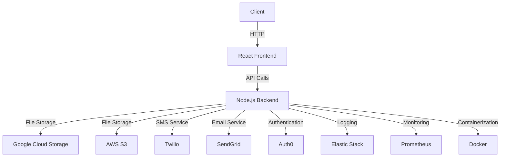

# 🎯 Talent Platform - JPD Hub Hackathon 2025

<div align="center">
  
  
  [](https://jpdhub.com)
  [](https://advitiya.iitrpr.ac.in)
  []()
  []()
</div>


## 🏆 Hackathon Submission
This project was developed for the JPD Hub x Advitiya Hackathon 2025, IIT Ropar.

### Team Details
| Name | Role | GitHub |
|------|------|--------|
| Yugandhar Bhardwaj | Project Manager | [@github](https://github.com) |
| Rudra Pratap Singh | Frontend-Backend Integrator | [@Rudra00codes](https://github.com/Rudra00codes) |
| Anant Srivastava | Feature Developer | [@RoboShep](https://github.com)
| Prince Sharma |  Researcher  | [@github](https://github.com) |
| Aditya Punj | UI/UX Designer | [@github](https://github.com) |

## 💡 Problem Statement
JPD Hub needs a Talent Module that connects talented individuals with clients while maintaining admin control. The platform should:
- Enable talent registration and profile management
- Provide client access to talent pool
- Include admin controls for profile verification
- Facilitate hiring process management


## 🎯 Our Solution
<div align="center">
  
</div>

### Key Features
- 👤 **Smart Talent Profiles**
  - Skill-based categorization
  - Portfolio integration
  - Experience verification
- 🔍 **Advanced Search & Filters**
  - Multi-parameter search
  - Experience level filtering
  - Skill-based matching
- 👮 **Admin Dashboard**
  - Profile verification system
  - Analytics and reporting
  - User management

## 🖥️ Demo & Screenshots

<div align="center">
  
  
</div>

### 🔗 Live Demo
- [Frontend Application](https://your-demo-link.com)
- [Admin Dashboard](https://your-admin-demo.com)
- [Demo Video](https://youtube.com/your-demo-video)

## 📊 Architecture

#### The architecture of the Talent Platform consists of a React frontend that communicates with a Node.js backend.

#### The backend handles various services such as CRUD operations, file storage, SMS and email services, authentication, logging, monitoring, and containerization. Below is a visual representation of the architecture:



## 🛠️ Technology Stack

<div class="tech-grid" style="display: flex; gap: 20px;">
  
  
  
  
  
</div>

<br>

- **Frontend**: React.js with TypeScript
- **State Management**: React Context API
- **Styling**: Styled-components
- **Testing**: Jest and React Testing Library
- **Build Tool**: Vite
- **Package Manager**: npm

## 📂 Project Structure

<details>
  <summary>Click to expand!</summary>

```bash
talent-platform/
├── backend/
│   ├── config/
│   │   ├── database.js
│   │   └── whatsapp.js
│   ├── controllers/
│   │   ├── adminController.js
│   │   ├── clientController.js
│   │   └── talentController.js
│   ├── middleware/
│   │   ├── adminAuth.js
│   │   └── auth.js
│   ├── models/
│   │   ├── Client.js (deleted)
│   │   ├── Client.ts
│   │   ├── HireRequest.js
│   │   ├── Talent.js
│   │   ├── Talent.ts
│   │   └── User.js
│   ├── routes/
│   │   ├── adminRoutes.js
│   │   ├── clientRoutes.js
│   │   └── talentRoutes.js
│   ├── services/
│   │   ├── emailService.js
│   │   ├── fileUploadService.js
│   │   └── notificationService.ts
│   └── .env
├── talent-platform-frontend/
│   ├── public/
│   │   ├── banner.png
│   │   ├── index.html (deleted)
│   │   ├── manifest.json
│   │   ├── robots.txt
│   │   └── screenshots/
│   │       ├── dashboard.png
│   │       └── profile.png
│   ├── src/
│   │   ├── components/
│   │   │   ├── Navbar.tsx
│   │   │   ├── ProtectedRoute.tsx
│   │   │   ├── talent/
│   │   │   │   ├── TalentCard.tsx
│   │   │   │   ├── TalentList.tsx
│   │   │   │   └── TalentSearch.tsx
│   │   ├── pages/
│   │   │   ├── admin/
│   │   │   │   ├── Dashboard.tsx
│   │   │   │   ├── TalentApproval.js
│   │   │   ├── client/
│   │   │   │   ├── Dashboard.tsx
│   │   │   │   ├── Registration.tsx
│   │   │   ├── talent/
│   │   │   │   ├── Directory.tsx
│   │   │   │   ├── Profile.tsx
│   │   │   │   └── Registration.tsx
│   │   ├── styles/
│   │   │   ├── AdminDashboard.css
│   │   │   ├── TalentRegistration.css
│   │   ├── App.css
│   │   ├── App.tsx
│   │   ├── index.css
│   │   ├── index.jsx
│   │   ├── main.jsx
│   │   ├── reportWebVitals.js
│   │   ├── setupTests.js
│   ├── .gitignore
│   ├── eslint.config.js
│   ├── package.json
│   ├── package-lock.json
│   ├── README.md
│   ├── tsconfig.app.json
│   ├── tsconfig.json
│   ├── tsconfig.node.json
│   └── vite.config.ts
└── README.md
```
</details>

## 🚦 Getting Started

### Prerequisites

- Node.js (v14 or higher)
- npm (v6 or higher)

### Installation

1. Clone the repository:
    ```bash
    git clone https://github.com/yourusername/talent-platform.git
    ```
2. Navigate to the project directory:
    ```bash
    cd talent-platform/talent-platform-frontend
    ```
3. Install dependencies:
    ```bash
    npm install
    ```
4. Start the development server:
    ```bash
    npm run dev
    ```
5. Open your browser and navigate to `http://localhost:3000` to view the application.

## 🛠️ Built With

- [React](https://reactjs.org/) - A JavaScript library for building user interfaces.
- [TypeScript](https://www.typescriptlang.org/) - A statically typed superset of JavaScript.
- [Vite](https://vitejs.dev/) - A fast build tool for modern web projects.
- [Tailwind CSS](https://tailwindcss.com/) - A utility-first CSS framework.
- [React Router](https://reactrouter.com/) - A collection of navigational components that compose declaratively with your application.
- [Axios](https://axios-http.com/) - A promise-based HTTP client for the browser and Node.js.
- [Redux](https://redux.js.org/) - A predictable state container for JavaScript apps.
- [Redux Toolkit](https://redux-toolkit.js.org/) - The official, opinionated, batteries-included toolset for efficient Redux development.
- [React Query](https://react-query.tanstack.com/) - A powerful data-fetching library for React.
- [React Hook Form](https://react-hook-form.com/) - A library for managing forms in React.
- [Zod](https://zod.dev/) - A TypeScript-first schema declaration and validation library.
- [ESLint](https://eslint.org/) - A tool for identifying and reporting on patterns found in ECMAScript/JavaScript code.
- [Conventional Commits](https://www.conventionalcommits.org/) - A specification for adding human and machine-readable meaning to commit messages.


## 📝 Development Approach

This project follows these key principles:

- **Component-Based Architecture**: Modular and reusable components
- **Type Safety**: Strict TypeScript implementation
- **Clean Code**: Following SOLID principles and clean code practices
- **Responsive Design**: Mobile-first approach
- **Accessibility**: Following WCAG guidelines

## 🔑 Key Design Decisions

- **TypeScript**: Chosen for type safety and better developer experience
- **Styled-components**: For component-scoped styling and dynamic theming
- **Context API**: For state management, avoiding Redux complexity for our use case
- **Custom Hooks**: For reusable logic and cleaner components

## 📚 Documentation

Additional documentation can be found in the `/docs` directory:

- API Documentation
- Component Documentation
- Contributing Guidelines

## 🤝 Future Scope
<input disabled="" type="checkbox"> AI-powered talent matching
<input disabled="" type="checkbox"> Integrated video interview platform
<input disabled="" type="checkbox"> Blockchain-based skill verification
<input disabled="" type="checkbox"> Mobile application development

## 🤝 Contributing

1. Fork the repository
2. Create your feature branch (`git checkout -b feature/AmazingFeature`)
3. Commit your changes (`git commit -m 'Add some AmazingFeature'`)
4. Push to the branch (`git push origin feature/AmazingFeature`)
5. Open a Pull Request

🙏 Acknowledgements
JPD Hub for the opportunity
Advitiya IIT Ropar for hosting
[ third-party resources]

## 📄 License

This project is licensed under the MIT License - see the LICENSE.md file for details.